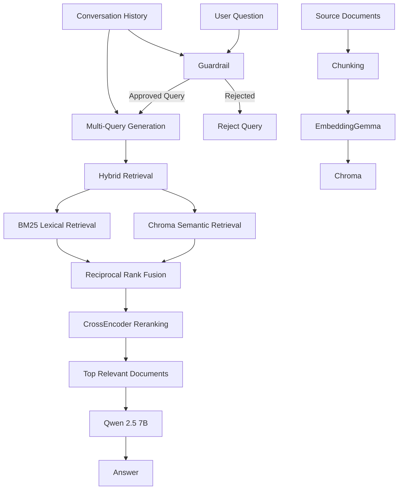

# Local RAG & AI Guardrail System

A fully local Retrieval-Augmented Generation (RAG) system for domain-specific question answering, built with LangChain, Chroma, BM25, CrossEncoder reranking, and locally hosted Ollama models.

The project combines a multi-stage retrieval pipeline with two approaches to query guardrails: an embedding + CrossEncoder guardrail used in the main RAG pipeline, and a lightweight TF-IDF + Logistic Regression classifier explored as an alternative first-pass filter.

## Overview

The system processes a collection of domain-specific documents and uses them to answer user questions without relying on a hosted LLM API.

**Core technologies:**

* **Qwen 2.5 7B** — local language model served through Ollama
* **EmbeddingGemma** — local embedding model
* **Chroma** — persistent vector database
* **BM25** — lexical retrieval
* **Reciprocal Rank Fusion (RRF)** — combines semantic and lexical retrieval
* **CrossEncoder** — reranks retrieved documents by query-document relevance
* **LangChain** — retrieval, model, and document-processing framework
* **scikit-learn** — TF-IDF + Logistic Regression guardrail experiment

The application also maintains short-term conversation history and transforms context-dependent follow-up questions before retrieval.

---

## Architecture



## Document Ingestion

Source documents are loaded from `documents/` and processed through the ingestion pipeline:

```text
Documents
   ↓
Document Loading
   ↓
Cleaning / Chunking
   ↓
Semantic Chunking
   ↓
EmbeddingGemma
   ↓
Chroma
```

The application uses document hashes to detect newly added, modified, or deleted documents. This allows the persistent Chroma store to synchronize with the source document directory.

---

## RAG Pipeline

The retrieval pipeline uses multiple stages rather than relying on a single similarity search.

### 1. Multi-Query Generation

The initial user question is expanded into multiple search queries. This improves retrieval coverage when different wording can refer to the same concept.

### 2. Hybrid Retrieval

Each generated query is passed through two complementary retrieval methods:

* **Semantic retrieval:** Chroma vector similarity search
* **Lexical retrieval:** BM25 keyword-based search

Semantic retrieval helps identify conceptually related content, while BM25 provides stronger matching for exact terminology and keywords.

### 3. Reciprocal Rank Fusion

Results from the semantic and lexical retrievers are combined using Reciprocal Rank Fusion with equal weights.

```text
Chroma ──┐
         ├── RRF ──→ Combined Candidates
BM25 ────┘
```

This provides a broader candidate set before expensive reranking.

### 4. CrossEncoder Reranking

The combined candidates are scored using:

`cross-encoder/ms-marco-MiniLM-L-6-v2`

The CrossEncoder evaluates the query and document together and produces a relevance score. The highest-ranked documents are then passed to the language model.

### 5. Local Generation

The selected context is provided to **Qwen 2.5 7B**, running locally through Ollama, which generates the final answer.

---

## Query Guardrails

The project uses a multi-stage guardrail to prevent unrelated questions from reaching the retrieval and generation pipeline.

### Embedding + CrossEncoder Guardrail

The primary guardrail uses semantic similarity as an inexpensive first filter:

```text
User Question
      ↓
Embedding Similarity
      ↓
Candidate Documents
      ↓
CrossEncoder Relevance
      ↓
Approved / Rejected
```

For contextual follow-up questions, the system can transform the question using the conversation history before performing another relevance check.

This allows questions such as follow-ups to an earlier topic to retain their conversational context without requiring the user to restate the original question.

### Lightweight ML Guardrail Experiment

A separate experiment explored whether a traditional text classifier could provide an inexpensive first-pass filter before invoking the more computationally involved guardrail/RAG pipeline.

The classifier uses:

* TF-IDF vectorization
* Logistic Regression
* Balanced class weighting

Training examples were generated from the project's domain documents using an LLM and then evaluated using a held-out test split.

The experiment was treated as an alternative approach rather than assuming it should replace the existing semantic guardrail.

---

## Guardrail Evaluation

The guardrail was tested against several categories of queries:

* Relevant questions
* Irrelevant questions
* Context-dependent follow-ups
* Borderline queries

Thresholds for the semantic and CrossEncoder stages were empirically tuned based on observed behavior across these test categories.

The ML guardrail classifier achieved:

* **84.6% accuracy**
* **0.86 precision / recall / F1 for irrelevant queries**
* **0.83 precision / recall / F1 for relevant queries**
* **13-example held-out test set**

The small evaluation set means these results should be interpreted as a proof-of-concept measurement rather than a statistically robust benchmark.

One notable training-data issue involved a hard negative containing the phrase "Karate framework" in an unrelated context. Because TF-IDF relies heavily on lexical features, this example caused legitimate Karate framework questions to be incorrectly classified as irrelevant. Removing the misleading example and retraining corrected the behavior.

This highlighted the importance of training-data quality when using lightweight lexical classifiers for domain-specific guardrails.

---

## Project Structure

```text
local-rag-langchain/
│
├── documents/
│   ├── embeddings.txt
│   ├── karate_testing.txt
│   ├── project_management.txt
│   ├── RAG.txt
│   ├── rest_apis.txt
│   ├── spring_boot.txt
│   └── vector_databases.txt
│
├── database/
│   └── chroma_store.py
│
├── loaders/
│   └── document_loader.py
│
├── chunking/
│   └── semantic_chunker.py
│
├── embeddings/
│   └── embedding_service.py
│
├── main.py
├── rag.py
├── guardrail.py
├── conversation_history.py
│
├── ml_guardrail.py
├── ml_guardrail_service.py
├── ml_guardrail_test.py
├── training_data_generator.py
│
├── training_data.json
├── guardrail_test_data.json
├── model.joblib
├── vectorizer.joblib
│
├── config.py
├── requirements.txt
├── setup.sh
└── README.md
```

### Key Components

| File                              | Purpose                                                                         |
| --------------------------------- | ------------------------------------------------------------------------------- |
| `main.py`                         | Application entry point and conversation loop                                   |
| `rag.py`                          | Multi-query generation, hybrid retrieval, RRF, reranking, and answer generation |
| `guardrail.py`                    | Embedding + CrossEncoder query guardrail                                        |
| `conversation_history.py`         | Conversation-memory storage and retrieval                                       |
| `database/chroma_store.py`        | Chroma initialization and document synchronization                              |
| `loaders/document_loader.py`      | Source document loading and preprocessing                                       |
| `chunking/semantic_chunker.py`    | Semantic document chunking                                                      |
| `embeddings/embedding_service.py` | Embedding generation                                                            |
| `ml_guardrail.py`                 | TF-IDF + Logistic Regression training                                           |
| `ml_guardrail_service.py`         | Loads and runs the trained ML guardrail                                         |
| `training_data_generator.py`      | Generates domain-specific training examples                                     |
| `ml_guardrail_test.py`            | End-to-end testing of the ML guardrail + RAG pipeline                           |

---

## Setup

### Prerequisites

* Python 3.14+
* Ollama
* Git
* Sufficient local storage and memory for the Qwen 2.5 7B model

Install Ollama separately before running the project setup script.

### 1. Clone the Repository

```bash
git clone <https://github.com/deltacoder27/local-rag-langchain.git>
cd local-rag-langchain
```

### 2. Run the Setup Script

```bash
chmod +x setup.sh
./setup.sh
```

The setup script:

1. Creates the Python virtual environment
2. Installs dependencies from `requirements.txt`
3. Downloads the Qwen 2.5 7B model
4. Downloads the EmbeddingGemma model

### 3. Run the Application

The repository contains two runnable paths: the **main RAG application** and a separate **ML guardrail experiment**.

#### Main RAG Application

The main application uses the embedding + CrossEncoder guardrail described above, followed by the multi-query hybrid RAG pipeline.

```bash
source .venv/bin/activate
python main.py
```

This runs the complete interactive application with:

* Query guardrail
* Conversation-aware query transformation
* Multi-query generation
* Chroma semantic retrieval
* BM25 lexical retrieval
* Reciprocal Rank Fusion
* CrossEncoder reranking
* Local Qwen 2.5 7B generation
* Short-term and persistent conversation history

Type `exit` to end the session.

#### ML Guardrail Experiment

The ML guardrail experiment replaces the primary semantic guardrail with the **trained TF-IDF + Logistic Regression classifier**.

```bash
source .venv/bin/activate
python ml_guardrail_test.py
```

This script initializes the same document and RAG infrastructure, but uses the trained ML classifier as the first-pass query relevance filter. Approved queries are then passed into the RAG pipeline, allowing the ML guardrail to be evaluated in an end-to-end application flow rather than only as an isolated classifier.

The experiment was used to investigate whether a lightweight traditional ML model could provide a lower-cost alternative for initial query filtering before more computationally involved retrieval and reranking steps.

---

## Example

```text
Enter your question (or 'exit' to quit): What is RAG?

Answer: RAG stands for Retrieval augmented generation. It combines
document retrieval with language model generation.
```

An unrelated question can be rejected before reaching the RAG pipeline:

```text
Enter your question (or 'exit' to quit): What is the weather today?

Your question was rejected by the guardrail. Please rephrase your question.
```

---

## Reproducibility

The project intentionally does **not** commit the generated Chroma databases.

Instead, the source documents in `documents/` are treated as the source of truth. When the application starts, the document scanner checks the persistent vector store against the current documents and synchronizes additions, modifications, and deletions.

This keeps the repository smaller while allowing the vector database to be regenerated on another machine.

The trained ML guardrail artifacts (`model.joblib` and `vectorizer.joblib`) and training dataset are included so the ML guardrail can be used without retraining.

---

## Limitations

* The ML guardrail was evaluated on a small held-out dataset and is intended as a proof-of-concept.
* Local model inference requires significant system resources.
* Retrieval quality depends on document coverage and chunking.
* Follow-up questions can still fail when the required conversational context is ambiguous.
* The lightweight ML classifier can be sensitive to misleading lexical patterns in training data.

## Future Improvements

Potential extensions include:

* Larger and more systematically constructed guardrail evaluation sets
* Improved hard-negative generation and validation
* More sophisticated conversation-memory management
* Retrieval and generation observability
* Additional reranking and retrieval experiments
* More comprehensive automated evaluation of the complete RAG pipeline